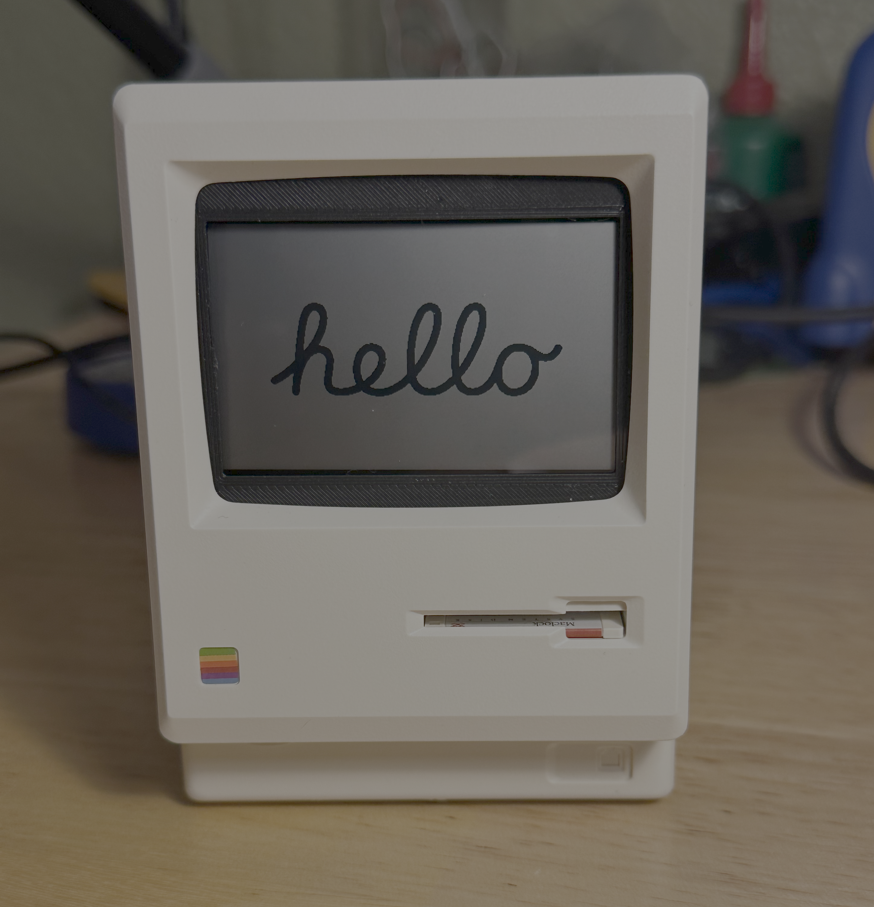
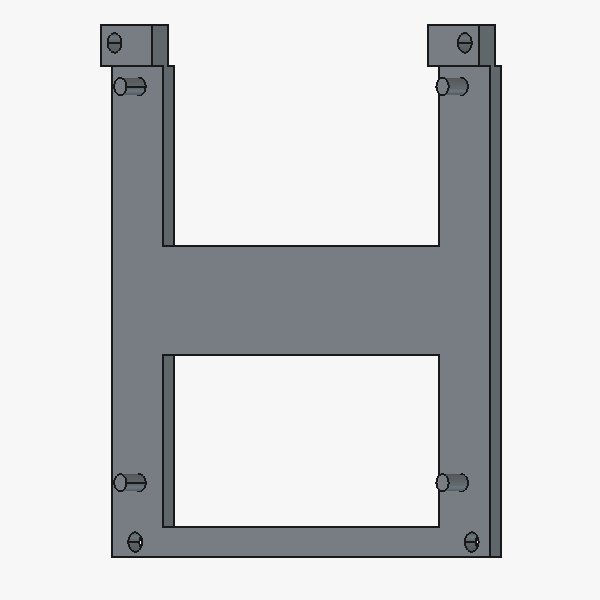
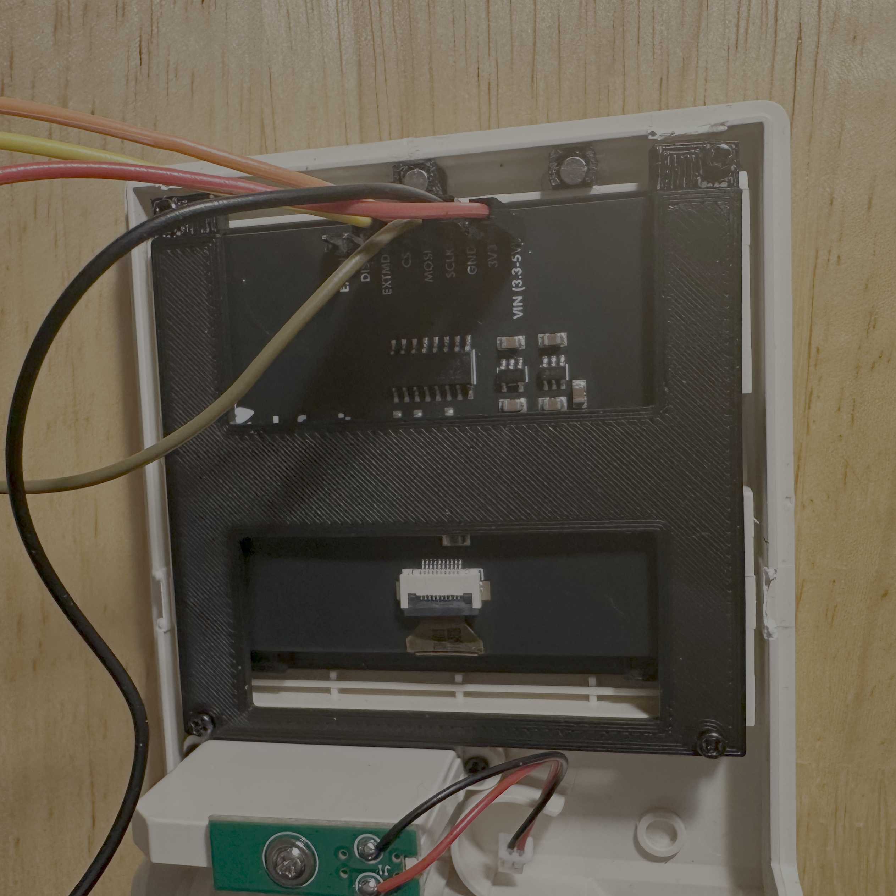
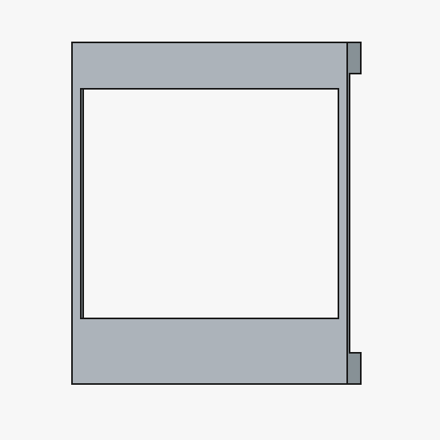

# Maclock Screen Mount for Adafruit/SHARP Memory Display

<div align="center">

</div>

This repository contains STL and FreeCAD files for a screen mounting bracket that enables mounting the [Adafruit SHARP Memory Display](https://www.adafruit.com/product/4694?srsltid=AfmBOop2fba985qKqFtM6lWqFD_dQ7sxt8O5NbKmIlSQCmeBmKEhnr0H) into the Maclock enclosure.

## Background

The Maclock is a cool little Mac-inspired clock that you can (somehow still?) buy for around $20. 

I bought one with the idea of replacing the internals with an e-paper display (and new controller board), but finding a compatible e-paper screen turned out to be a challenge since most e-paper displays in the <3in. range are either too large or have an aspect ratio that would look silly (I think most e-paper displays of this size category are probably desinged for digital price tags).

I ended up finding the [Adafruit SHARP Memory Display Breakout - 2.7" 400x240 Monochrome](https://www.adafruit.com/product/4694?srsltid=AfmBOop2fba985qKqFtM6lWqFD_dQ7sxt8O5NbKmIlSQCmeBmKEhnr0H). I was not familiar with this type of 'memory' display before, but it has a similar viewing experience to e-paper displays, and (more importantly) it fits perfectly in the Maclock enclosure!

## Files

I desinged two 3D-printable parts which can be used to mount this screen nicely into the Maclock housing with no modifications required (other than disassembly):


```
freecad/
├─ SharpDisplayV10.FCStd            - The FreeCAD project containing both parts
stl/
├─ SharpDisplayV10-Bracket.stl      - The bracket which mounts the screen 
│                                     to the Maclock frame.
├─ SharpDisplayV10-ScreenCover.stl  - The screen cover which fills the gaps 
                                      on the screen to give a clean look.
```

Apologies in advance to any profesional CAD users who venture into the FreeCAD project, I am still learning FreeCAD and CAD in general.

### Bracket 


<div align="center">





[Link to STL](stl/SharpDisplayV10-Bracket.stl)

</div>

### Screen Cover

<div align="center">



[Link to STL](stl/SharpDisplayV10-ScreenCover.stl)

</div>

## Printing and Mounting

I printed all parts using black PLA+ filament on my Ender 3V2 with default settings.

The screen should mount onto the four raised posts, and then it can be attached into the front portion of the enclosure using four screws (Re-using the original screws and screw holes). 

The holes on the bracket are clearance holes, so there should be no binding between the screws and the bracket itself.

The screen cover can slide on top of the screen using the same raised posts used to hold the screen onto the bracket. The cover is *not* symmetric, so make sure you have it rotated the correct way to avoid blocking parts of the screen.

> [!WARNING] 
> The front (outward facing) portion of the screen cover is paper thin, so take care when removing the screen cover from the build plate, and when mounting or removing it on the screen.


## License

This work is licensed under CC BY-NC-SA 4.0. To view a copy of this license, visit https://creativecommons.org/licenses/by-nc-sa/4.0/ 

You are free to use, copy, and modify these files as you wish, but commercial use is not permitted.

